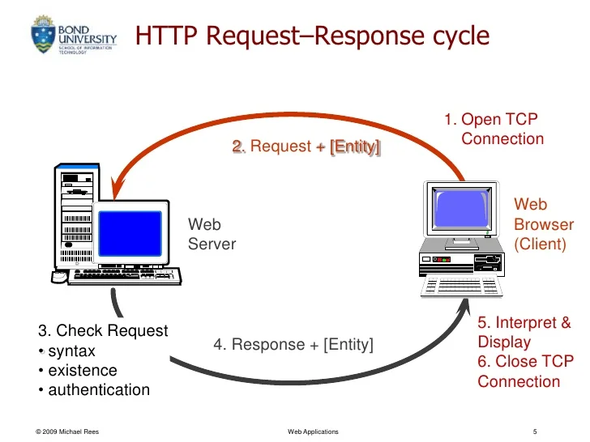

#  WRRC And Java  
## HTTP Lifecycle

### 1. Local Processing
Depending on how in depth you want to get, much can happen during this step depending on the application making the request
1. Your browser extracts the "scheme"/protocol
2. Now that the browser has the intended hostname for the request, it needs to resolve an IP address1. The browser will then look through its own cache of recently requested URLs, the operating system’s cache of recent queries, your router’s cache, and your DNS cache.
### 2. Resolve an IP  
Like the processing done locally, resolving an IP from a "DNS server"2 is a sequence that includes many steps, and includes failovers if the first request fails to return an address.

1. If the cache lookup fails (we will assume it does), your browser fires off a DNS request using UDP3. The DNS request contains the preconfigured IP for your DNS server and your return IP in its header.
2. Your request will now have to travel many network devices to reach its target DNS server.
3. Once your request arrives at your configured DNS server, the server looks for the address associated with the requested hostname.
4. We will assume the request is successful though, given that all of this is still a precursor. If the response makes it back (remember, with UDP there’s no guarantee!), the requesting client now has a target IP
 ### 3. Establish a TCP Connection 
 Now that the client has an IP address, it can send an HTTP5 request, right? Almost, but first, since the request is sent over TCP6, which is a transport layer protocol like UDP, the client must open a TCP connection.
### 4. Send an HTTP Request 
Wow, that was a bunch of steps! But now that the client has an IP address and a TCP connection, it can finally send an HTTP request! Except…..no I’m kidding, we can send a request for real this time!
### 5. Tearing Down annd Cleaning UP 
___
## Do a Simple HTTP Request in Java   
### 1. HTTPUrlConnection 
The HttpUrlConnection class allows us to perform basic HTTP requests without the use of any additional libraries. All the classes that we need are part of the java.net package.
### 2. Createing a Request 
We can create an HttpUrlConnection instance using the openConnection() method of the URL class. Note that this method only creates a connection object but doesn't establish the connection yet.
The HttpUrlConnection class is used for all types of requests by setting the requestMethod attribute to one of the values: GET, POST, HEAD, OPTIONS, PUT, DELETE, TRACE.  
* EX:  
 URL url = new URL("http://example.com");  
HttpURLConnection con = (HttpURLConnection) url.openConnection();  
con.setRequestMethod("GET");  
### 3. Adding Request Parameters
If we want to add parameters to a request, we have to set the doOutput property to true, then write a String of the form param1=value¶m2=value to the OutputStream of the HttpUrlConnection instance:
### 4. Setting Request Headers      
Adding headers to a request can be achieved by using the setRequestProperty() method:
con.setRequestProperty("Content-Type", "application/json");  
To read the value of a header from a connection, we can use the getHeaderField() method:  

String contentType = con.getHeaderField("Content-Type");  
### 5. Configuring Timeouts
HttpUrlConnection class allows setting the connect and read timeouts. These values define the interval of time to wait for the connection to the server to be established or data to be available for reading.
### 6. Handling Cookies   
The java.net package contains classes that ease working with cookies such as CookieManager and HttpCookie.
### 7. Handling Redirects
We can enable or disable automatically following redirects for a specific connection by using the setInstanceFollowRedirects() method with true or false parameter:
### 8. Reading the Response
Reading the response of the request can be done by parsing the InputStream of the HttpUrlConnection instance.

To execute the request, we can use the getResponseCode(), connect(), getInputStream() or getOutputStream() methods:
### 9. Reading the Response on Failed Requests
If the request fails, trying to read the InputStream of the HttpUrlConnection instance won't work. Instead, we can consume the stream provided by HttpUrlConnection.getErrorStream().

We can decide which InputStream to use by comparing the HTTP status code:
### 11. Building the Full Response
It's not possible to get the full response representation using the HttpUrlConnection instance.
### 12. Conclusion
In this article, we showed how we can perform HTTP requests using the HttpUrlConnection class.
