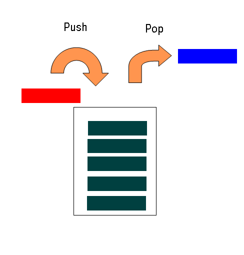
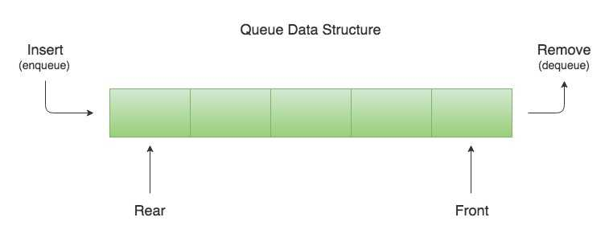

# Stack And Queue 
## 1. Stack  (FILO) - First In Last Out
is A data structure that consots of Nodes Each Node references the next Node in the stack but does not reference its previous.  
* Common terminology for a stack is :  
1. Push : Nodes or items that are put into the stack are pushed.
2. Pop : Nodes or items that are moved from the stack are popped, when you attempt to pop an empty stack an exception will be raised.
3. Top : This is the top of the stack. 
4. Peek : When you peek you will view the value of the top Node in the stack when you attempt to peek an empty stack an exception will be raised. 
5. isEmpty : returns true when stack is empty otherwise return false.
## * Stack Visualization

___
## 2. Queue (FIFO) - First In First Out
is A data structure that consots of Nodes Each Node references the next Node in the queue but does not reference its previous.
* Common terminology for a queue is : 
1. Enqueue : Nodes or items that are added to the queue.  
2. Dequeue : Nodes or items that are removed from the queue
3. Front : This is the front Node of the queue. 
4. Rear : This is the last Node of the queue. 
5. Peek : when you peek you will view the value of the front Node in the queue . if called when the queue is empty an exception will be raised.
6. isEmpty : returns true when Queue is empty otherwise return false
## * Queue Visualization

____
