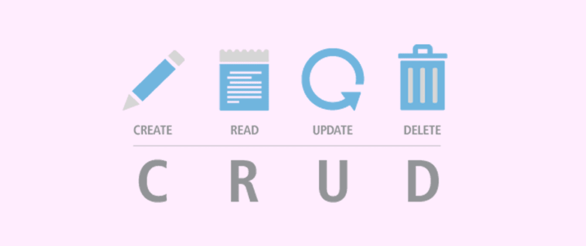

# Accessing Data with JPA
we use Spring Data JPA ot store and retrieve data in a relational database 
## 1. The dependencie that we use it to call JPA library
we want to choice this dependencie before we download the spring ZIP folder :   
Spring Data JPA SQL  
Persist data in SQL stores with Java Persistence API using Spring Data and Hibernate. 
## 2. Define a Simple Entity   
* any class is annotated with @Entity, indicating that it is a JPA entity. (Because no @Table annotation exists, it is assumed that this entity is mapped to a table named Customer.)  
* we use @Id annotated to define the attribute that found inside class as a id   
and we add @GeneratedValue to this id attribute will generated automatically   
* any attributes we add inside class will be as a column inside database .
## 3.Create Simple Queries   
  * Spring Data JPA focuses on using JPA to store data in a relational database. Its most compelling feature is the ability to create repository implementations automatically, at runtime, from a repository interface.  
  To see how this works, create a repository interface that works with class entities as the following listing  
* the repository interface must extend from CrudRepository.

# CrudRepository 
# 1. Soring Data Repositories  
* CrudRepository provides CRUD functions      
  
* PagingAndSortingRepository   
    provides methods to do pagination and sort records. 
* JpaRepository  
    provides JPA related methods such as flushing the persistence context and delete records in a batch. 
# 2. CrudRepository 
* Example 
    public  interface CrudRepository<T, ID extends Serializable>
  extends Repository<T, ID> {  

    <Sextends T>  S save(S entity);  

    T findOne(ID primaryKey);  

    Iterable<T> findAll();  

    Long count();  

    void delete(T entity);  

    boolean exists(ID primaryKey);  
}  
* CRUD functionality :  
    1. save(…) – save an Iterable of entities. Here, we can pass multiple objects to save them in a batch
    2. findOne(…) – get a single entity based on passed primary key value
    3. findAll() – get an Iterable of all available entities in database
    4. count() – return the count of total entities in a table
    5. delete(…) – delete an entity based on the passed object
    6. exists(…) – verify if an entity exists based on the passed primary key value

# 3. PagingAndSortingRepository
* Example  
    public interface PagingAndSortingRepository<T, ID extends Serializable>
  extends CrudRepository<T, ID> {  

    Iterable<T> findAll(Sort sort);  

    Page<T> findAll(Pageable pageable);  
}  
* PagingAndSortingRepository functionality :  
    1. Page size
    2. Current page number
    3. Sorting
# 4. JpaRepository 
* Example:  
    public interface JpaRepository<T, ID extends Serializable> extends
  PagingAndSortingRepository<T, ID> {  

    List<T> findAll();  

    List<T> findAll(Sort sort);  
  
    List<T> save(Iterable<? extends T> entities);  

    void flush();  

    T saveAndFlush(T entity);  

    void deleteInBatch(Iterable<T> entities);  
}    
* JpaRepository functionality :  
    1. findAll() – get a List of all available entities in database
    2. findAll(…) – get a List of all available entities and sort them using the provided condition
    3. save(…) – save an Iterable of entities. Here, we can pass multiple objects to save them in a batch
    4. flush() – flush all pending task to the database
    5. saveAndFlush(…) – save the entity and flush changes immediately
    6. deleteInBatch(…) – delete an Iterable of entities. Here, we can pass multiple objects to delete them in a batch

 

