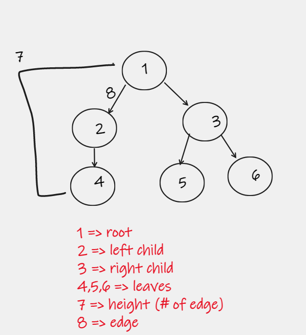
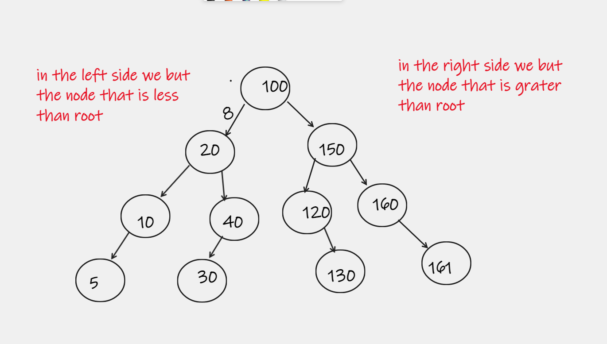

# Trees

## Common Terminology in Tree   

___

## Travesals
* ##  Depth First : we have three ways .   

    1. Pre-order : (root => left => right) Example of the image above:  
    output : (1, 2, 4, 3, 5, 6)
    2. in-order : Reverse the Per-order (left => root => right) Example of the image above:
    output : (4, 2, 1, 5, 3,6)
    3. post-order (legt => right => root) Example of the image above:  
    output (4, 2, 5, 6, 3, 1)
    

*  ## Bredth First : take the root then all children for this root start from the left root  
    * Example of the image above:   
    output : (1, 2, 3, 4, 5, 6)  
    we Use queue in this way .
* ## K-arry Trees 
    when we use this way we want to queue and then we must to apply the bredth first but with some change this chnange is :  
    1. we start from the root and enqueue the root 
    2. then we move to another level then we will to dequeue() and then we will enqueue() all the childern that's under the root
    3. then we will move to another level ehen we will to dequeue() and then we will enqueue() all the childern that's under the root'.
    4. we will continuo do this process untill the queue is not empty  
* ## Binary Serch Tree

* Big O notation  
    space Time : O(1)  
    complex Time  : O(n)
    