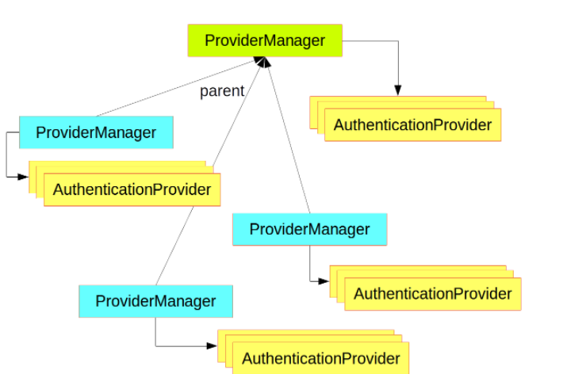

# Spring Authentication

## Spring Security Architecture

* The main strategy interface for authentication is (AuthenticationManager) as a provider manager this AutheManager can do one of theree things  

    1. Return an "Authentication"  if it can verify that the input represents a valid principal.

    2. Trow na "AuthenticationException" represent an invalid principal

    3. Return null if cannot decide  

* A ProviderManager has an optional parent, which it can consult if all providers return null. If the parent is not available, a null Authentication results in an AuthenticationException.

___

* in the spring security in web we add another ;ayer that is called FileterChainProxy that have multible Fileter layer

# Spring Auth Cheat Sheet

## Steps for Authentication Cheat Sheet 

1. set up a user model and repo 

2. create controller  

3. UserDetailsServiceImpl implements UserDetailsService

4. ApplicationUser implements UserDetails

5. WebSecurityConfig extends WebSecurityConfigurerAdapter  

6. registration page

7. login page
