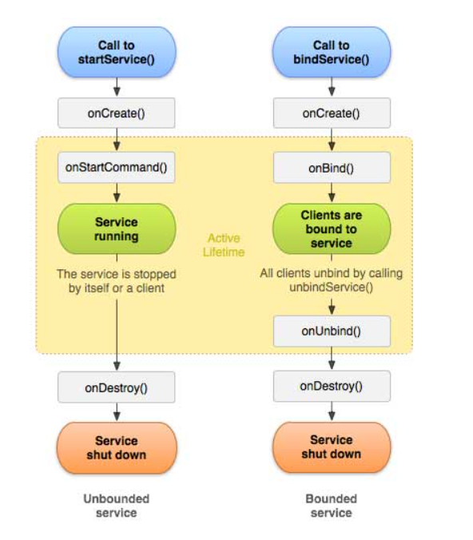
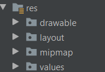

# Application Fundamentals

## What I Understood from Article Reading?

* ##  That The Android Studio Is A Independent Platform and Open Source.

* ##  and We Have Some Features To Secure Our App :

    1. The Android operating system is a multi-user Linux system in which each app is a different user.
    2. The system sets permissions for all the files in an app so that only the user ID assigned to that app can access them.
    3. Each process has its own virtual machine (VM), so an app's code runs in isolation from other apps.

___

* ## App components

1. Activities :  
    Is Entry Point For Interacting With The User.
2. ServiCes :  
    is a general-purpose entry point for keeping an app running in the background for all kinds of reasons. It is a component that runs in the background to perform long-running operations or to perform work for remote processes
    * Types Of Services  
        1. Started : A service is started when an application component, such as an activity, starts it by calling startService(). Once started, a service can run in the background indefinitely, even if the component that started it is destroyed.

        2. Bound : A service is bound when an application component binds to it by calling bindService(). A bound service offers a client-server interface that allows components to interact with the service, send requests, get results, and even do so across processes with interprocess communication (IPC)
        
        3. Broadcast Receivers
            A broadcast receiver is a component that enables the system to deliver events to the app outside of a regular user flow
        4. Content Providers 
            manages the user's content information 
___ 

* ## Manifest File 
    
    * Identifies any user permissions the app requires, such as Internet access or read-access to the user's contacts.
    * Declares the minimum API Level required by the app, based on which APIs the app uses.
    * Declares hardware and software features used or required by the app, such as a camera, bluetooth services, or a multitouch screen.
    * Declares API libraries the app needs to be linked against (other than the Android framework APIs), such as the Google Maps library.

* ## Declaring components

* Declare App Compunents:
    1. <activity> elements for activities.
    2. <service> elements for services.
    3. <receiver> elements for broadcast receivers.
    4. <provider> elements for content providers.

* ## App Resources

* The Resources That we nedd in our App Such as (animations, menus, styles, colors, and the layout of activity user interfaces with XML files) we can store it in res Folder in android studio  
    
