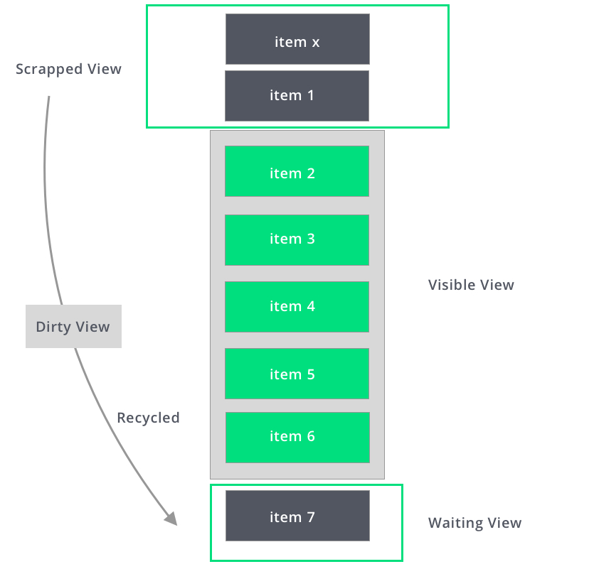

# Create dynamic lists with RecyclerView

* we use it to display large sets of data.
* When an item scrolls off the screen, RecyclerView doesn't destroy its view. Instead, RecyclerView reuses the view for new items that have scrolled onscreen. This reuse vastly improves performance, improving your app's responsiveness and reducing power consumption.  
Example :  

## Key classes

* There is severel different classes work together to build your dynamic list  
    1. add the RecyclerView into your layout.
    2. Each individual element in the list is defined by a view holder object.we define the view holder by extending RecyclerView.ViewHolder.
    3. binds the views to their data, by calling methods in the adapter. You define the adapter by extending RecyclerView.Adapter.
    4. use LayoutManager

## Setps for implementing your RecyclerView

1. select the layoutManager.
2. Design how each element in the list is going to look.
3. Define the Adapter that associates your data with the ViewHolder views.

## Layout Type

1. LinearLayoutManager.
2. GridLayoutManager.
3. StaggeredGridLayoutManager.

## implementing your adapter and view holder

* When you define your adapter, you need to override three key methods:

1. onCreateViewHolder () : to Create new ViewHolder.
2. onBincViewHolder () : to link a ViewHolder with data.
3. getItemCount () : to Get The Size Of data set

