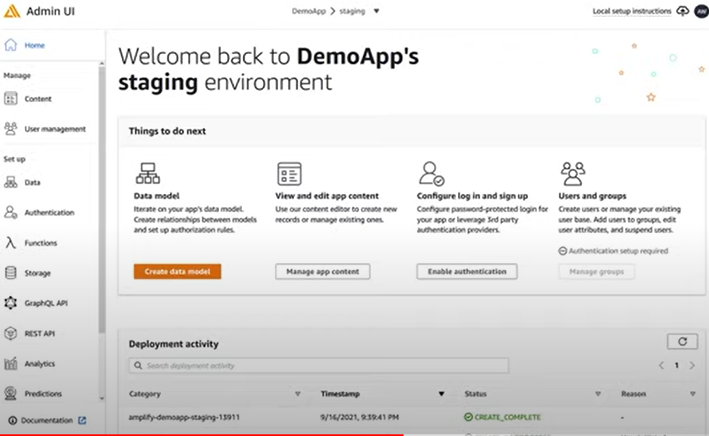

# AWS Amplify

* AWS Amplify is a powerful toolkit developers use to build full stack applications that directly integrate with the cloud. Using it, developers can rapidly setup, test, launch, and scale production ready applications with minimal time spent focusing on the details.
* Amplify is mainly aimed at full stack applications, but you can also use it just for its ability to generate a backend

## Now the main strength of Amplify

* is that it quickly lets you add thigs like Storage, Authentication, Monitoring, and PubSub functionalities. Now you don’t need to know what Amplify is provisioning behind the scenes to add these functions. For example, if you decide to use something like Storage, you may be provisioning one or more components from a multitude of AWS Services without actually knowing about it.

* Amplify simply leverages CloudFormation to define templates for the components you add, and uses it to deploy those resources to the cloud.

## Example of Amplify Features

* for every features inside this pictures has a service . 

## Usage 

1. Command Line Interface (CLI)
    * The CLI is a library that you can install to your terminal to interact with the library.
    * To configure a new project, we use the amplify configure and amplify init commands
    * After initially setting up our application, we’re free to start adding some application components.
    * To add one, we use the command amplify add api to provision our new api
2. Admin UI 
    * The Admin UI does have some neat features such as the Data Model Studio. Using it, you can easily add Data Models including their fields and types.
    * Admin UI as the portal to get a physical view of the components your building through the console
    

## Pros of Amplify

1. Getting Started Quickly
2. Fast Development Cycles
3. shielding From the Complexity of AWS 
    * Amplify flips this problem on its head. Instead of starting with a problem, and trying to figure out which service(s) to solve that problem, Amplify offers a solution oriented mindset. By offering direct functions or features as components such as Storage, Authentication, Analytics, and others, developers don’t need to care about which AWS services are being used behind the scenes, they generally just worry about the end product.

## Con of Amplify

1. You Don't Really Learn AWS
2. Collaboration Can Be Frustrationg
3. Stepping Outside The Box
4. Potential For Surprise Bills
