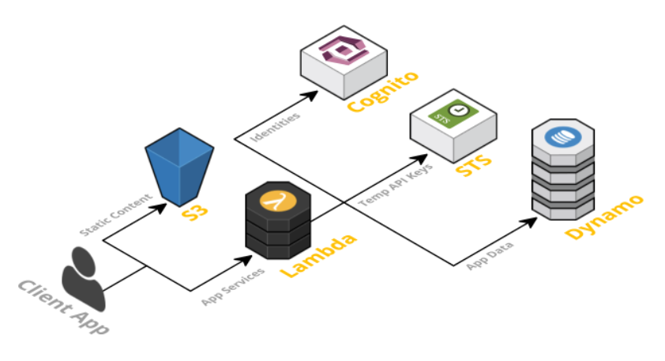

# Serverless

## What is the serverless.

* Serverless is a cloud computing execution model where the cloud provider dynamically manages the allocation and provisioning of servers.

* Here are some of the currently available cloud services:
    1. AWS Lambda
    2. Google Cloud functions
    3. Huawei Cloud
    4. IBM

## Pros and Con For Serverless

1. Pricing :  
    The cost model of Serverless is execution-based: you’re charged for the number of executions
2. Environments :  
    you no longer need to set up dev, staging, and production machines. Eventually you’d lose count of all the environments, at some point.
3. Timeouts 
4. Netwoking :  
    The downside is that Serverless functions are accessed only as private APIs. To access these you must set up an API Gateway. This doesn’t have an impact on your pricing or process, but it means you cannot directly access them through the usual IP
5. 3rd Party Dependencies :  
6. Scale :  
    Scaling process for Serverless is automatic and seamless, but there is a lack of control or entire absence of control.

## FaaS

* is a serverless way to run functions in any cloud environment.

* Principles of FaaS:
    1. Complete management of servers
    2. Invocation based billing
    3. Event-driven and instantaneously scalable

## Teh Serverless App

* A Serverless solution consists of a web server, Lambda functions (FaaS), security token service (STS), user authentication and database.

1. Client Application : The UI.
2. Web Server : Amazon S3 provides a robust and simple web server. All of the static HTML,Css and JS files.
3. Lambda functions (Faas) : AWS Lambda is used in this framework. The application services for logging in and accessing data will be built as Lambda functions. These functions will read and write from your database and provide JSON responses.
4. Securuty Token Service (STS) :  generate API key and secret key for users to invoke the AWS API
5. User Authentication : you can easily add user sign-up and sign-in to your mobile and web apps. It also has the options to authenticate users through social identity providers such as Facebook, Twitter or Amazon,
6. Database :  AWS DynamoDB provides a fully managed NoSQL database

## Benefits of Serverless Architecture

1. From Business Perspectibe : the main thing is reduce the cost.
2. From Developer Perspective : Faster set up and Reduced liability, Zero system adminsistration ........ so on.
3. From user perspective :
    1. It is possible that users can more easily provide their own storage backend(i.e Dropbox, Google Drive).
    2. It’s more likely that these kinds of apps may offer client-side caching, which provides a better offline experience.

## Drawbacks of Serverless Architecture

1. From Business Perspectibe :
    1. Reduced overall control.
    2. Security risk.
    3. Disaster recobery risk.
2. From developer perspective :
    1. Architectural complexity.
    2. Testing locally becomes tricky.
    3. Execution duration is capped.
3. From user perspective :
    * Unless architected correctly, an app could provide a poor user experience as a result of increased request latency.

___

# API (GRAPHQL)

## Data Modeling

* Amplify automatically creates Amazon DynamoDB database tables for GraphQL types annotated with the @model directive in your GraphQL schema.

* The Amplify CLI generates the Todo database table upon amplify push and generates a GraphQL API to perform create, read, update, delete, and list operations for the Todo model.
