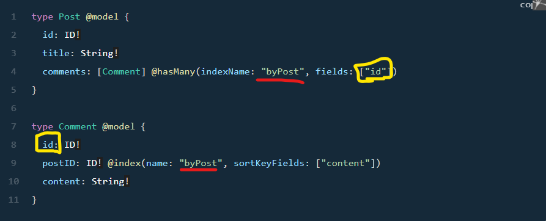

# Has Many Relationship 

* @HasMany : 
    1. we use this notation to create a one-directional one-to-many relationship between two models 
    2. configures a secondary index on the related table to enable you to query the related model from the source model.
        * First, configure a secondary index using @index. Then, pass in the secondary index name indexName parameter and the respective fields which match the connected index.
        * Ex :  
             

# Using CompletabelFuture as a Simple Future

* the CompletableFuture class implements the Future interface, so we can use it as a Future implementation, but with additional completion logic.

* A CompletableFuture is an extension to Java's Future API which was introduced in Java 8. A Future is used for asynchronous Programming. It provides two methods, isDone() and get(). The methods retrieve the result of the computation when it completes.

* get() : The consumers may use the get method to block the current thread until this result is provided.

* Executors : We use it  To spin off the computation. This method of creating and completing a CompletableFuture can be used together with any concurrency mechanism or API, including raw threads.

* If we already know the result of a computation, we can use the static completedFuture method with an argument that represents a result of this computation
