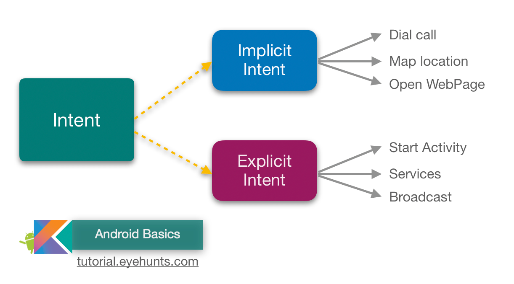

# Intent Filter

* If your app can perform an action that might be useful from another app, your app should be prepared to respond to action requests by specifying the appropriate intent filter in your activity. like a social App.

* To allow other apps to start your activity in this way,
    - add an <intent-filter> element in your manifest file for the corresponding <activity> element.

## Add an Intent Filter 

* The system may send a given Intent to an activity if that activity has an intent filter fulfills the following criteria of the Intent object:
    - Action : A string naming the action to perform. Usually one of the platform-defined values such as ACTION_SEND or ACTION_VIEW.
    - Data : Specify this in your intent filter with the <data> element.
    - Category : Provides an additional way to characterize the activity handling the intent, usually related to the user gesture or location from which it's started.are defined with CATEGORY_DEFAULT by default.

## Handle the Intent in your Activity 

* In order to decide what action to take in your activity, you can read the Intent that was used to start it.
* call getIntent() to retrieve the Intent that started the activity
* You can do so at any time during the lifecycle of the activity, but you should generally do so during early callbacks such as onCreate() or onStart().

## Return a Result 

*  simply call setResult() to specify the result code and result Intent , then finish() to close your activity
* You must always specify a result code with the result. Generally, it's either RESULT_OK or RESULT_CANCELED

# Intent Types 

## 1. Explicit Intents 
* specify which application will satisfy the intent, by supplying either the target app's package name or a fully-qualified component class name. You'll typically use an explicit intent to start a component in your own app, because you know the class name of the activity or service you want to start

## 2. Implicit Intents

*  do not name a specific component, but instead declare a general action to perform, which allows a component from another app to handle it.

___