# Introduction To sql
## SQL queries
1. Select   
    we use Select to select column and row from a table  
    Ex : select * From Table_Name;  
    ### Exercise 1 :  
    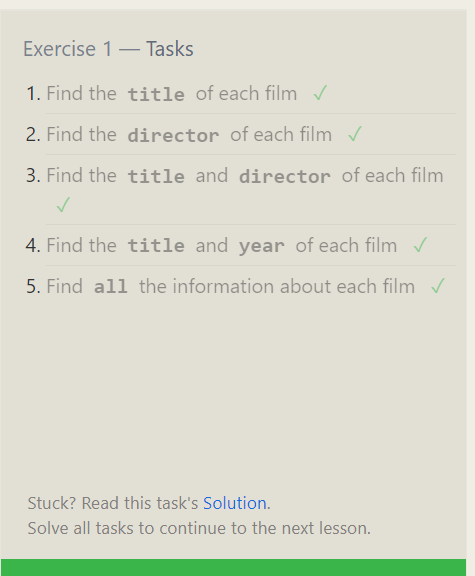  
2. Where  
    we use where statements to select specific row  
    Ex : select * From Table_Name where column > 10;
    ### Exercise 2 :   
    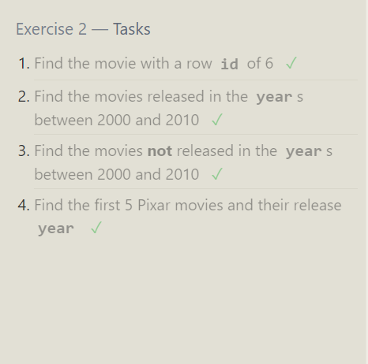  
3. LIKE  
    we use link to compare to select specific string value  
    EX : select * From Table_Name Like "%moh%"  || Table_Name Like "moh%"  
         Table_Name Like "%moh" || Table_Name Not Like "Text"  
    ### Exercise 3 
    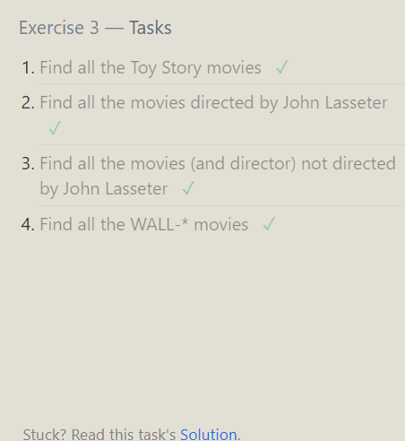    
4. Order By   
    we use it to order the table according the column (Asc , Desc)  
    EX : select * From Table_Name order by column_name Asc;  
    ### Exercise 4
    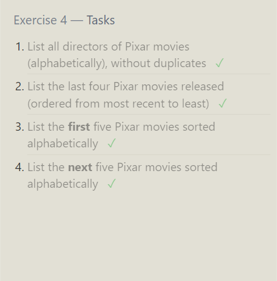    
    ### Exercise 5 : 
    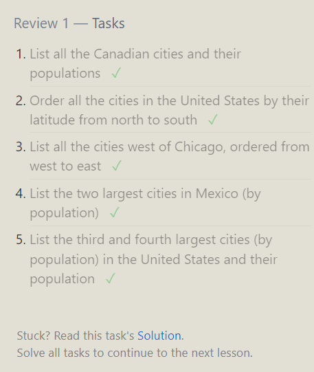  
    ### Exercise 6 :   
    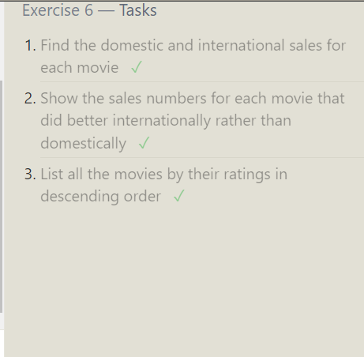 
___
___  

## Database Management
1. Insert Row  
    Ex : insert into Table_name(col1, col2, col3) Values (val1 , val2 , val3)  
    ### Exercise 13 : 
    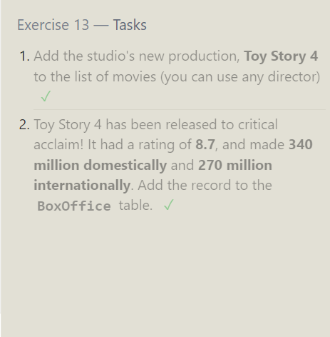   
2. Update Row  
    Ex : update Table_name set col1 = val, col2= val .... where ..  
    ### Exercise 14 :  
    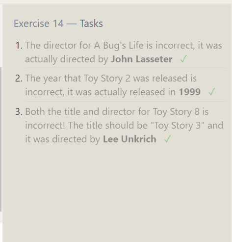
3. Delete Row   
    EX : delete from Table whaere ....   
    ### Exercise 15 : 
    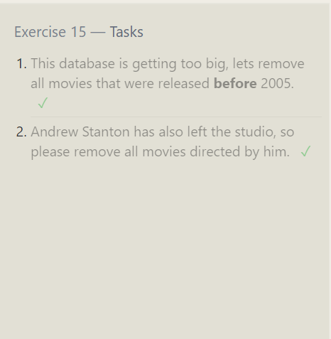  
4. Create Table   
    data_type :  (INTEGER, TEXT, VARCHAR, BOOLEAN, DATE, FLOAT , DOUBLE)  
    EX : create table table_name (  
        colum_name data_Type , column2_name data_type
    )  
    ### Exercise 16 :   
    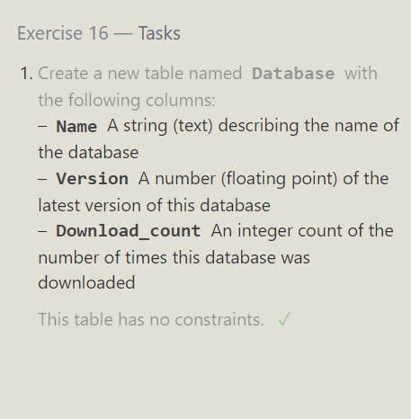  
5. Alter Table  
    we use it to modify the table after we create it such as add column or remove it   
    EX Add : alter table table_name  
         add column DataType  
         DEFAULT default_value;  
    ex Delete : Alter Table table_name  
                DROP column_name;  
    ### Exercise 17 :   
    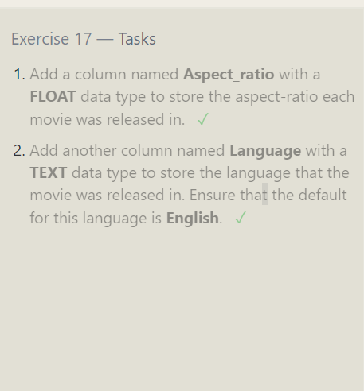  
6. Delete Table   
    with use Drop Table_name  
    Ex : Drop Table If Exists table_name;  
    ### Exercise 18 :  
    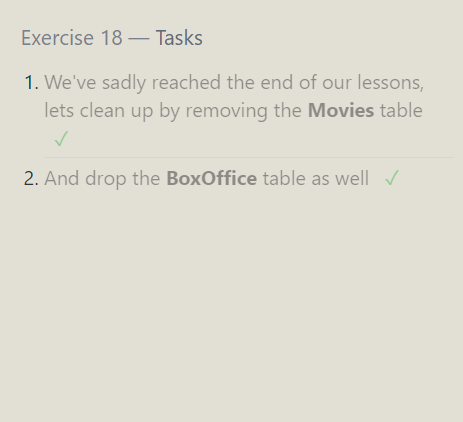